# OOP Tank Game — Extraction Shooter

 A 2D extraction shooter / tank war game built with JavaFX, showcasing Object-Oriented Design and multiple design patterns.

---

## Overview

This project is a merge of a classic tank war concept with modern extraction-shooter mechanics. Players control a tank or human/AI characters, loot weapons and gear, and try to survive raids by defeating enemies and safely extracting with their loot.

---

## Features

### Gameplay

- **Player-controlled Characters**
  - Move, fire weapons, pick up loot, and extract.
  - Equip different gear sets with buffs and debuffs.
  
- **AI Players**
  - Roam, fight other players, and behave like NPC scavengers.
  - Spawn with random gear and weapons (P2, MP5, AK).
  
- **Scientists**
  - Stationary guards protecting loot containers.
  - Spawn with P2 or MP5 and Hazmat gear.
  
- **AITank (Bradley APC)**
  - High-health hostile vehicle.
  - Shoots rockets at players, drops high-value loot on death.
  
- **Loot & Inventory**
  - Weapons, ammo, gear sets, consumables, and loot containers.
  - Inventory is temporary; stash persists across raids.
  
- **Extraction Zones**
  - Players can extract their loot to move items from their raid inventory to the persistent stash.

---

### Systems

- **Event System**: Handles entity deaths, loot spawns, and extractions using Observer pattern.
- **Buff/Decorator System**: Dynamically applies gear or temporary item buffs to players.
- **Flyweight System**: Shared immutable resources (sprites, audio clips, loot configs) to optimize memory usage.
- **Factories**: Create entities, weapons, and loot objects consistently.
- **Strategies**: AI movement and loot behaviors separated for SRP.

---

## Project Structure

```mermaid
---
config:
  look: neo
title: TakeBradley - Extraction Shooter
---
classDiagram
direction TB
    class Main {
	    -Canvas canvas
	    -GameController gameController
	    -StartScreenController startScreenController
	    -GameRenderer gameRenderer
	    -InputHandler inputHandler
	    -Player player
	    -Stash stash
	    -Inventory loadout
	    +start(Stage)
	    +startRaid()
	    +returnToStartScreen()
    }

    class StartScreenController {
	    -Stash stash
	    -Inventory loadout
	    -StartScreenRenderer renderer
	    -StartScreenInputHandler inputHandler
	    -AnimationTimer renderLoop
	    +initialize(Canvas)
	    +start()
	    +stop()
	    +transferLoadoutToPlayer(Player)
    }

    class GameController {
	    -GameWorld gameWorld
	    -SpawnController spawnController
	    -ExfilController exfilController
	    -GameRenderer gameRenderer
	    -InputHandler inputHandler
	    -Stash playerStash
	    +startRaid()
	    +endRaid()
	    +onEvent(GameEvent)
	    +setPlayerStash(Stash)
    }

    class InputHandler {
	    -Player player
	    -GameWorld gameWorld
	    -ExfilController exfilController
	    -GameRenderer gameRenderer
	    -LootUIRenderer lootUIRenderer
	    -boolean isExtracting
	    -double extractionProgress
	    +handleKeyPressed(KeyEvent)
	    +handleKeyReleased(KeyEvent)
	    +update(double)
    }

    class StartScreenInputHandler {
	    -StartScreenRenderer renderer
	    -Stash stash
	    -Inventory loadout
	    +handleKeyPressed(KeyEvent)
    }

    class GameWorld {
	    -List~Entity~ entities
	    -GameMap map
	    -Player player
	    +updateAll(double)
	    +addEntity(Entity)
	    +getEntities()
    }

    class Player {
	    -UUID id
	    -String name
	    -double x, y
	    -int health
	    -Inventory inventory
	    -Stash stash
	    -Direction facingDirection
	    +move(double, double)
	    +takeDamage(int)
	    +fireWeapon()
	    +reload()
	    +extract()
    }

    class GameMap {
	    -List~Zone~ zones
	    -List~Wall~ walls
	    +getZones()
	    +getWalls()
    }

    class Entity {
	    +getId()
	    +getName()
	    +getX()
	    +getY()
	    +isAlive()
	    +update(double)
	    +getInventory()
    }

    class Movable {
	    +move(double, double)
	    +setPosition(double, double)
	    +getSpeed()
	    +setSpeed(double)
    }

    class Combatant {
	    +getHealth()
	    +getMaxHealth()
	    +takeDamage(int)
	    +heal(int)
	    +die()
	    +fireWeapon()
	    +reload()
	    +getFacingDirection()
	    +setFacingDirection(Direction)
	    +getDamageResistance()
	    +setDamageResistance(double)
    }

    class BradleyAPC {
	    -AIMovementStrategy movementStrategy
	    -CombatStrategy combatStrategy
	    -int health
	    -double speed
	    +update(double)
	    +fireWeapon()
    }

    class NpcPlayer {
	    -AIMovementStrategy movementStrategy
	    -Inventory inventory
	    -int health
	    +update(double)
    }

    class Scientist {
	    -AIMovementStrategy movementStrategy
	    -Inventory inventory
	    -int health
	    +update(double)
    }

    class LootCrate {
	    -Inventory inventory
	    -boolean looted
	    +isLooted()
	    +setLooted(boolean)
    }

    class EliteCrate {
	    -Inventory inventory
	    -boolean looted
    }

    class Projectile {
	    -double velocityX
	    -double velocityY
	    -int damage
	    -Entity owner
	    +update(double)
    }

    class Inventory {
	    -List~InventorySlot~ slots
	    -int capacity
	    -Entity owner
	    -GearItem equippedGear
	    +addItem(LootItem)
	    +removeItem(int)
	    +removeAllItems()
	    +getItem(int)
	    +isEmpty()
	    +findAmmo(AmmoType)
    }

    class InventorySlot {
	    -LootItem item
	    +getItem()
	    +setItem(LootItem)
	    +isEmpty()
    }

    class Stash {
	    -int DEFAULT_STASH_SIZE
	    +depositAll(List~LootItem~)
    }

    class LootItem {
	    -String name
	    -String description
	    +use(Entity)
	    +getName()
	    +getDescription()
    }

    class WeaponItem {
	    -WeaponType weaponType
	    -int damage
	    -int magazineSize
	    -int currentAmmo
	    -AmmoType ammoType
	    -FireMode fireMode
	    +reload(int)
	    +fire()
	    +canFire()
	    +update()
    }

    class MP5 {
    }

    class RocketLauncher {
    }

    class AmmoItem {
	    -AmmoType ammoType
	    -int quantity
	    +getQuantity()
	    +setQuantity(int)
	    +getAmmoType()
    }

    class PistolAmmo {
    }

    class RifleAmmo {
    }

    class RocketAmmo {
    }

    class GearItem {
	    -GearType gearType
	    -List~Buff~ buffs
	    +applyBuffs(Entity)
	    +removeBuffs(Entity)
	    +getGearType()
    }

    class HazmatGear {
    }

    class HeavyPotGear {
    }

    class RoadSignGear {
    }

    class WolfHeadGear {
    }

    class MedItem {
	    -MedType medType
	    -int quantity
	    +setQuantity
	    +getQuantity()
    }

    class GameRenderer {
	    -Canvas canvas
	    -Camera camera
	    -SpriteManager spriteManager
	    -BackgroundRenderer backgroundRenderer
	    -EntityRenderer entityRenderer
	    -HUDRenderer hudRenderer
	    -LootUIRenderer lootUIRenderer
	    -boolean showingPostRaid
	    -boolean playerExtracted
	    +initialize(Canvas)
	    +render(GameWorld, Player)
	    +showExtractionOverlay()
	    +showDeathOverlay()
    }

    class StartScreenRenderer {
	    -int selectedStashIndex
	    -int selectedLoadoutIndex
	    -FocusArea currentFocus
	    -int scrollOffset
	    +renderStartScreen(GraphicsContext, Stash, Inventory)
	    +selectUp(Stash)
	    +selectDown(Stash)
	    +switchFocus()
	    +transferSelectedItem(Stash, Inventory)
    }

    class Camera {
	    -double x, y
	    -double viewportWidth
	    -double viewportHeight
	    +centerOn(double, double)
	    +isVisible(double, double, double, double)
    }

    class SpriteManager {
	    -Map~String, Image~ spriteCache
	    +loadSprites()
	    +getPlayerSprite(GearType, Direction)
	    +getBradleySprite(Direction)
    }

    class HUDRenderer {
	    +renderHUD(GraphicsContext, Player)
	    +renderHealthBar(GraphicsContext, int, int)
	    +renderAmmoCounter(GraphicsContext, Player)
	    +renderHotbar(GraphicsContext, Player)
    }

    class LootUIRenderer {
	    -Entity currentContainer
	    -int selectedSlotIndex
	    -boolean open
	    +openLootUI(Entity, double, double)
	    +closeLootUI()
	    +renderLootUI(GraphicsContext)
    }

    class StashSerializer {
	    +serialize(Stash, String) boolean
    }

    class StashDeserializer {
	    +deserialize(String, Entity) Stash
    }

    class EventPublisher {
	    -Map~Class, List~EventObserver~~ observers
	    +subscribe(Class, EventObserver)
	    +publish(GameEvent)
    }

    class SpawnController {
    }

    class ExfilController {
    }

    class EventObserver {
    }

    class BackgroundRenderer {
    }

    class EntityRenderer {
    }

    class AK {
    }

    class P2 {
    }

    class Bandage {
    }

    class Syringe {
    }

	<<interface>> Entity
	<<interface>> Movable
	<<interface>> Combatant
	<<abstract>> LootItem
	<<abstract>> WeaponItem
	<<abstract>> AmmoItem
	<<abstract>> GearItem
	<<abstract>> MedItem
	<<static>> StashSerializer
	<<static>> StashDeserializer
	<<singleton>> EventPublisher

    Main --> StartScreenController
    Main --> GameController
    Main --> GameRenderer
    Main --> Player
    Main --> Stash
    StartScreenController --> StartScreenRenderer
    StartScreenController --> StartScreenInputHandler
    StartScreenController --> Stash
    StartScreenController --> Inventory
    GameController --> GameWorld
    GameController --> GameRenderer
    GameController --> InputHandler
    GameController --> SpawnController
    GameController --> ExfilController
    GameController --> Stash
    GameController ..> EventObserver
    InputHandler --> Player
    InputHandler --> GameWorld
    InputHandler --> GameRenderer
    InputHandler --> ExfilController
    GameWorld --> Player
    GameWorld --> GameMap
    GameWorld --> Entity
    Player ..|> Entity
    Player ..|> Combatant
    Player --> Inventory
    Player --> Stash
    BradleyAPC ..|> Entity
    BradleyAPC ..|> Combatant
    BradleyAPC ..|> Movable
    NpcPlayer ..|> Entity
    NpcPlayer ..|> Combatant
    Scientist ..|> Entity
    Scientist ..|> Combatant
    LootCrate ..|> Entity
    Inventory --> LootItem
    Inventory --> GearItem
    Stash --|> Inventory
    WeaponItem --|> LootItem
    GearItem --|> LootItem
    AmmoItem --|> LootItem
    P2 --|> WeaponItem
    AK --|> WeaponItem
    MP5 --|> WeaponItem
    RocketLauncher --|> WeaponItem
    MedItem --|> LootItem
    Bandage --|> MedItem
    Syringe --|> MedItem
    HazmatGear --|> GearItem
    HeavyPotGear --|> GearItem
    RoadSignGear --|> GearItem
    WolfHeadGear --|> GearItem
    PistolAmmo --|> AmmoItem
    RifleAmmo --|> AmmoItem
    RocketAmmo --|> AmmoItem
    GameRenderer --> Camera
    GameRenderer --> SpriteManager
    GameRenderer --> BackgroundRenderer
    GameRenderer --> EntityRenderer
    GameRenderer --> HUDRenderer
    GameRenderer --> LootUIRenderer
    StartScreenRenderer --> Stash
    StartScreenRenderer --> Inventory
    GameController --> StashSerializer
    Main --> StashDeserializer
    GameController --> EventPublisher
```

---

## Persistence

- Player stash is serialized to JSON.
- Raid inventory is temporary and cleared on death unless extracted.
- Auto-save triggers on loot extraction or stash modification.

---

## Dependencies

- Java 17+
- JavaFX 20+ (or matching version)
- Gson (or other JSON library for stash serialization)

---
